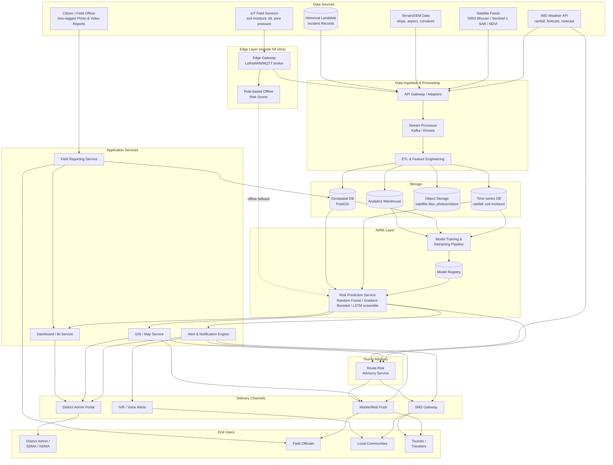
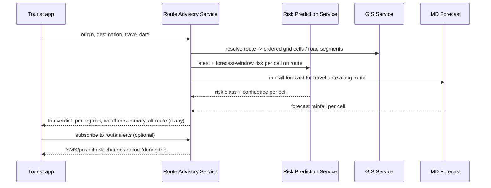

# AI-Based Early Warning & Landslide Risk Monitoring System — NER
### Technical Architecture

---

## 1. Design goals derived from the problem statement

| Requirement | Architectural response |
|---|---|
| Multi-source data (rainfall, soil, satellite, terrain, history) | Unified **Data Ingestion Layer** with per-source adapters into a common time-series + geospatial store |
| AI/ML risk prediction | **Risk Prediction Service**: cloud ensemble model + lightweight **edge fallback** model |
| Real-time alerts to admins & citizens | **Alert & Notification Service** (rules engine on top of ML output) → SMS/IVR/App/Dashboard |
| GIS visualization | **GIS/Map Service** (vector tiles + heatmap layer) consumed by dashboard & mobile app |
| Citizen/field geo-tagged reporting | **Field Reporting Service** with offline-first mobile capture |
| Dashboards (risk, roads, weather, response priority) | **Dashboard/BI Layer** over a read-optimized analytics store |
| Multilingual + low-network/offline | Localization at UI layer + **offline-first sync architecture** (queue + CRDT-style merge) throughout |

---

## 2. High-level system architecture



---

## 3. Component breakdown

### 3.1 Data Ingestion Layer
- **Adapters** per source: IMD REST/SOAP API poller (rainfall, nowcast), ISRO Bhuvan WMS/WCS client (satellite tiles, NDVI, SAR displacement), sensor telemetry via **MQTT** over LoRaWAN/NB-IoT from field gateways, static DEM/slope raster loaded once and refreshed periodically, historical incident CSV/DB import from state DM departments.
- **API Gateway** normalizes all sources into a common schema (`cell_id`, `timestamp`, `metric`, `value`, `geometry`) before publishing to a **Kafka**-style stream so ingestion spikes (monsoon burst reporting) don't overwhelm downstream services.

### 3.2 Storage
- **Time-series DB** (e.g., TimescaleDB/InfluxDB) — rainfall & soil sensor readings, optimized for windowed aggregates (24h/72h cumulative rainfall used as model features).
- **PostGIS** — grid cells, district/village boundaries, road network, risk polygons, field-report locations — powers GIS queries and heatmap tile generation.
- **Object storage** (S3-compatible) — satellite imagery tiles, citizen-uploaded photos/videos.
- **Analytics warehouse** — flattened features + outcomes for model training/retraining and for the BI dashboards.

### 3.3 AI/ML Risk Prediction Engine — see `risk_engine.py` prototype
- **Feature set**: 24h/72h rainfall, rainfall intensity, soil moisture %, slope angle, NDVI (vegetation/root stability), soil erodibility, historical incident count, road proximity (impact, not hazard).
- **Cloud model**: ensemble classifier (prototype uses Random Forest; production would compare against Gradient Boosted Trees and an LSTM/temporal model for rainfall-sequence-aware prediction) outputting a 4-level risk class (**Low / Moderate / High / Critical**) with calibrated probabilities per grid cell, refreshed on each new sensor/rainfall update (target: every 15–30 min during active monsoon, hourly otherwise).
- **Retraining pipeline**: scheduled retraining as new confirmed incidents and near-miss field reports accumulate; model versions tracked in a registry so a bad retrain can be rolled back without downtime.
- **Edge fallback**: a small rule-based scorer (weighted threshold sum — see `edge_rule_based_risk()` in the prototype) runs directly on the gateway at the sensor cluster. When the gateway loses connectivity it keeps producing local risk verdicts and can trigger a **local siren/SMS via GSM backup**, then syncs queued readings to the cloud once connectivity returns so the cloud model can later be evaluated/retrained against what actually happened.
- **Known limitation to flag honestly**: CRITICAL-class landslide events are rare in any real historical record — class imbalance needs oversampling/cost-sensitive learning and human-in-the-loop review before an alert model goes live, not just raw accuracy.

### 3.4 Alert & Notification Engine
- Consumes risk verdicts + configurable thresholds/escalation rules (e.g., HIGH → SMS+App, CRITICAL → SMS+App+IVR+siren trigger).
- Renders **multilingual templates** (English + regional languages — Assamese, Bengali, Bodo, Khasi, Mizo, Nepali, Manipuri, etc.) selected by recipient's registered preference.
- Delivers via SMS gateway (works on feature phones — critical for remote NER villages), IVR/voice call for critical alerts, push notification for smartphone users, and directly onto the district admin portal.
- Logs delivery/acknowledgement status for audit and post-event review.

### 3.5 GIS / Map Service
- Serves vector tiles (roads, villages, infrastructure) and a dynamic **risk heatmap layer** generated from the latest model output over PostGIS grid cells.
- Powers both the web dashboard and an offline map cache on the mobile app (pre-downloaded tiles for a district, so the map still works with no signal).

### 3.6 Field Reporting Service (citizen/field-official input)
- Mobile app capture of geo-tagged photo/video of cracks, slope movement, or blocked roads — **works fully offline**: capture is stored locally, queued, and synced when connectivity resumes (store-and-forward, conflict resolved by timestamp + device id).
- Submitted reports feed both the GIS layer (as a "field-observed" overlay distinct from model-predicted risk) and the training warehouse (ground-truth signal for model improvement).

### 3.7 Dashboard / BI Layer
Serves the four views called out in the problem statement, each a read-optimized query over the warehouse/GIS store:
- **Risk severity levels** — per-district/per-cell heatmap + ranked list.
- **Road connectivity status** — road segments flagged blocked/at-risk/clear, cross-referenced with field reports.
- **Weather-linked risk forecasts** — rainfall forecast (IMD) overlaid with predicted risk trend for next 24–72h.
- **Emergency response prioritisation** — ranked worklist (risk × population/infrastructure exposure × road access) to help SDMA/NDMA allocate response first where it matters most.

---

## 4. Tourist / Traveler Route Advisory

Tourists are a distinct user persona from district admins and residents: they don't want a per-sensor dashboard, they want one question answered — **"is my route safe, and what's the weather going to do to it?"** — before and during travel. Rather than new data infrastructure, this is a thin advisory layer that composes the risk model, GIS road data, and IMD forecast that already exist elsewhere in the system.

### 4.1 What it does
- **Route risk check**: traveler picks (or types) an origin and destination, or selects a popular circuit (e.g. Guwahati → Shillong → Cherrapunji). The service resolves the route to the sequence of monitoring grid cells / road segments it passes through and returns a single trip-level verdict — **Safe to travel / Caution / Avoid — high risk** — driven by the *worst* risk class on the path, not an average (you don't want a bad segment hidden by good ones on either side).
- **Per-leg breakdown**: each risk zone crossed shown with its own risk class, so a tourist can see *where* the risk is concentrated (e.g. "clear until Shillong, then high risk for the last 12 km").
- **Weather-linked forecast for the trip window**: pulls the IMD forecast for the travel date(s), not just current conditions — a route that's clear today but has heavy rain forecast tomorrow should surface that.
- **Suggested alternative**: when a route is flagged Avoid, the service checks whether a nearby lower-risk corridor exists (e.g. an alternate road) and surfaces it.
- **Opt-in trip alerts**: traveler can subscribe a route + date range and get SMS/push if the risk level changes before or during their trip — this reuses the existing Alert & Notification Engine and its multilingual templates, just scoped to a route instead of a district.
- **Offline-ready**: once a route is checked, the advisory + a cached map/road-status snapshot is stored on-device (same offline-first pattern as the field-reporting app), so a tourist who loses signal mid-journey still has the last-known advisory and an offline map, plus the departure-district's emergency helpline number.

### 4.2 How it composes existing components (no new core infra)


### 4.3 Indicative API
```
GET /v1/route-advisory?from=Guwahati&to=Cherrapunji&date=2026-08-25
→ {
    "trip_risk": "HIGH",
    "legs": [
      {"segment": "Guwahati–Shillong", "risk": "LOW", "road_status": "clear"},
      {"segment": "Shillong–Cherrapunji", "risk": "HIGH", "road_status": "partial"}
    ],
    "weather_summary": "Heavy rain forecast 25 Aug, 60–90mm expected on the Shillong–Cherrapunji stretch",
    "alternative_route": null,
    "advisory_text": "Delay travel past Shillong until conditions improve, or check back closer to your travel date."
  }

POST /v1/route-advisory/subscribe   { route_id, phone/device_id, date_range, lang }
```

### 4.4 Why worst-leg (not average) risk, and other honest caveats
- Averaging risk across a route can mask a genuinely dangerous stretch — trip verdicts use the maximum risk class on the path, deliberately conservative.
- Forecast-window risk is inherently less certain than "right now" risk (IMD forecast + hazard model, compounded uncertainty) — the UI should say "forecast" explicitly rather than presenting it with the same confidence as a live sensor reading.
- Alternate-route suggestion is only as good as the road network graph — in the first release this should be treated as an "informational option to check further," not an authoritative reroute, since off-model factors (permits, restricted zones, seasonal closures) aren't captured.

## 5. Offline-first & low-network strategy

This is a first-class requirement, not an afterthought, given NER connectivity realities:

1. **Edge gateways** at sensor clusters run the rule-based scorer locally and can trigger a local alert (siren/GSM SMS) without any cloud round-trip.
2. **Mobile app** uses local storage + a sync queue: field reports, cached risk maps, and cached alerts for the user's registered village/route are available with no signal; anything created offline syncs opportunistically.
3. **SMS/IVR** channels are treated as the primary channel for the general public (feature-phone reach), with app push as a secondary channel for smartphone users.
4. **Progressive data sync**: gateways batch and compress telemetry, prioritizing the most recent/most anomalous readings first when bandwidth is scarce.

---

## 6. Technology stack (indicative)

| Layer | Suggested technology |
|---|---|
| Edge/IoT | LoRaWAN or NB-IoT sensors, MQTT broker, lightweight Python/C rule engine on gateway (Raspberry Pi / industrial IoT gateway) |
| Ingestion/streaming | Kafka or AWS Kinesis, REST adapters for IMD/Bhuvan |
| Storage | TimescaleDB/InfluxDB (time-series), PostGIS (geospatial), S3-compatible object storage, Snowflake/BigQuery-class warehouse |
| ML | Python, scikit-learn / XGBoost for the tabular ensemble, PyTorch for a future LSTM rainfall-sequence model, MLflow-style model registry |
| Backend services | Python (FastAPI) or Node.js microservices, containerized |
| GIS | PostGIS + GeoServer/MapTiler-style tile server, MapLibre GL on the frontend |
| Dashboard/web | React + a charting library (e.g., Recharts) + MapLibre |
| Mobile | Flutter or React Native with offline-first local DB (SQLite/WatermelonDB) |
| Notifications | SMS gateway (e.g., Twilio-class / national telecom aggregator), IVR provider, FCM/APNs for push |
| Infra | Kubernetes on cloud (AWS/Azure/GCP or a Government cloud/NIC empanelled provider), CI/CD, infra-as-code |
| Security | TLS everywhere, OAuth2/JWT for service+user auth, role-based access (state/district/field-officer/citizen tiers), encrypted storage for citizen PII in reports |

---

## 7. Data flow summary (one monsoon-burst cycle)

1. Rainfall spikes at a sensor cluster → soil moisture sensor also rises → edge gateway locally scores risk and, if severe, fires a local SMS/siren immediately while also queuing the reading for upload.
2. Reading reaches the cloud ingestion layer → normalized → written to time-series + geospatial stores.
3. Risk Prediction Service recomputes the grid cell's risk class using latest rainfall/soil/terrain/satellite/history features.
4. If risk crosses HIGH/CRITICAL threshold → Alert Engine renders multilingual message → dispatched via SMS/IVR/push → district admin portal updated.
5. GIS layer + dashboards refresh to reflect new heatmap, road-status impact, and response-prioritisation ranking.
6. Field officials/citizens near the flagged zone can submit geo-tagged photos confirming (or contradicting) the model's read — this both informs the live GIS "field-observed" layer and becomes future training data.

---

## 8. What's included as a working prototype vs. what's a production TODO

**Included in this prototype (`risk_engine.py`):**
- Full feature schema matching the five required data categories.
- A trained Random Forest classifier on realistic synthetic data, with feature importances and a held-out evaluation report.
- An edge/offline rule-based fallback scorer.
- Alert-payload generation with multilingual templates.
- A route-level risk aggregation function (`assess_route_risk`) demonstrating the worst-leg trip verdict logic behind the tourist advisory feature.

**Included in the dashboard prototype (`dashboard.html`):**
- A "Plan your journey" panel where a traveler picks a route and gets a trip verdict, per-leg risk, and a weather-linked advisory — the tourist-facing counterpart to the admin risk map, sharing the same underlying district risk data.

**Production TODOs called out honestly:**
- Replace synthetic data with real IMD/Bhuvan/sensor/historical feeds; real data will need class-imbalance handling for CRITICAL events (they're rare, high-stakes, and precisely the class you can least afford to get wrong).
- Add a temporal model (LSTM/temporal CNN) to use rainfall *sequences* rather than only windowed sums.
- Human-in-the-loop review workflow before any CRITICAL public alert auto-dispatches, at least in the initial deployment phase.
- Formal model validation against India's Geological Survey (GSI) landslide susceptibility zonation for the region, as a sanity check on the ML output.
- Route Advisory needs a real road-network graph (not just risk-zone lookup) to genuinely resolve "which segments does this route cross" and to suggest alternates — the prototype approximates this with a curated route list.
